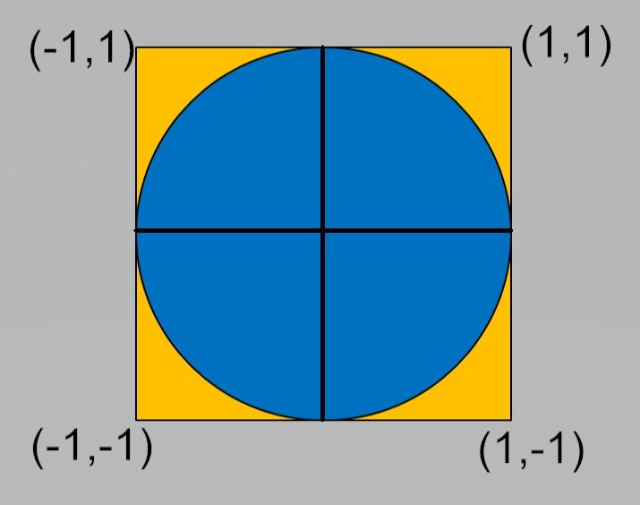

************************************************************************
Classical introduction to parallel computing - estimating pi in CUDA
************************************************************************

An easy introduction to parallel computing
------------------------------------------

A standard way to introduce the concepts of parallel programming is to look at some of the ways to approximate pi :math:`(\pi)`. Since CUDA exposes a highlevel of
parallelism on the GPU, a logical question is how well similar efforts run on a CUDA GPU.

One approach is to use a form of Monte-Carlo estimation on a quarter of a unit circle. This can be highly parallel, but not efficient.

The general idea is to generate a large number N of random pairs :math:`(x_i,y_i)` in [0,1]x[0,1]. 

Count the cases M when :math:`x_i^2 + y_i^2 \le 1` 
Then :math:`{M \over N} \approx {\pi \over 4}`

The idea is to generate these N random pairs in parallel. 

Care must be taken to ensure we have parallel random seeds and we need a global sum for M.

The standard way of generating pseudorandom numbers in CUDA is to use ``curand_init()`` and ``curand_uniform()`` as device functions, 
only callable from within kernel functions.

.. literalinclude::   pigreco.cu

Local changes to the code were to fix a compilation error, and to add in timings and an error estimate.

Output from the code on a Quadro P4000 is:

::

 Starting simulation with 1792 blocks, 32 threads, and 1000000 iterations
 Approximated PI using 57344000000 random tests
 PI ~= 3.14159992717634
 Pi  error is -0.0000072735865460 
 Monte pi took : 0.661215 sec .

This is a good deal of work and time for a fairly poor result.

There is another important aspect about this code. Notice that it limits the size of each thread block to 32 - the size of a thread warp,
that is the number of tightly coupled and synchronised threads in a unit of computation. CUDA does allows thread blocks to have up to
1024 blocks. Certainly in this case, there are reasons to suspect little performance gain by increasing the number of threads per block (or
the number of blocks for that matter), but it should be possible. If we just increase the number of threads per block from 32 to 64, we get
an interesting and wrong answer:

::

 ./montebig
 Starting simulation with 1792 blocks, 64 threads, and 1000000 iterations
 Approximated PI using 114688000000 random tests
 PI ~= 1.57781224898856
 Pi  error is 1.5637804046012329 
 Monte pi took : 1.256798 sec .

The reason for this severe under estimation of the answer is that threads in different warps need to be synchronised before thread[0] in
each thread group can accumulate the sums. Therefore a ``__syncthreads()`` call is needed before this summation is performed. When that is
added, we then get:

::

 ./montebig
 Starting simulation with 1792 blocks, 64 threads, and 1000000 iterations
 Approximated PI using 114688000000 random tests
 PI ~= 3.14159132240513
 Pi  error is 0.0000013311846594 
 Monte pi took : 1.222475 sec .

Also notice that doubling the number of threads in each thread group roughly doubles the compute time - reinforcing the suggestion that the
GPU resources are being used fully in the initial configuration. 

Moving onto faster but still parallel approximations
----------------------------------------------------

The next stage in an easy to understand parallel approximation of :math:`\pi` is to look at numerical quadrature approximations to an integral that also defines 
:math:`\pi`.

The standard formula is:

.. math:: \pi = \int_0^1 {4 \over (1+x^2)} dx

Of course, the integral can be broken into an arbitrary number of pieces. In Python or MATLAB environments running on mutli-core architectures, this is often the most
effective way to approximate :math:`\pi`.  The standard MPI parallel example approximates this integral with the composite mid-point rule.

This leads to:

.. math:: \pi = {1 \over N} \sum_{i=1}^N {4 \over {1 + \left( {i-0.5}\over N \right)^2 }}

In essence we are doing a parallel sum over the GPU threads. This is possible to do very efficiently and it is one of the Advanced examples in the CUDA samples code, see
``$CUDA_HOME/samples/6_Advanced/reduction`` to look at the code. Unfortunately, the code gets fairly complicated, which is why it is in the Advanced section.

The reason for the complexity is that by design there is no global synchronisation across all threads on the GPU. It is possible to synchronise a pool of threads
(which can  involve up to 1024 threads), but there is no easy way to synchronise across pools of threads. The simplest, but most inefficient way, is to sychronise
everything on the device with the CPU using the ``cudaDeviceSynchronize()`` command. 

In order to have code that is reasonably understandable, we work with a single pool of threads - not a silly option for what is actually a small amount of work.

Borrowing heavily from code provided (with a good overiew) in https://sodocumentation.net/cuda/topic/6566/parallel-reduction--e-g--how-to-sum-an-array- we have:

.. literalinclude:: cupi.cu

The results of this code on a system with a Skylake CPU and a Quadro P4000 is:

::

 Pi estimate 3.1415926535898766 error is -0.0000000000000835
 Time to compute mypi is 0.004875 sec.
 CPU pi is 3.1415926535897643  error is 0.0000000000000289
 Time to compute CPU pi is 0.016786 sec.

What is interesting in this case is that the computation on the GPU is faster than on the CPU on a relatively small workload.  Both are considerably faster and more accurate than the Monte Carlo
approximation.

The time required for the Monte Carlo approximation is lower on systems with v100 GPUs, but the integral approximation is still faster and more accurate.

On a system with a v100 and Cascade Lake 5218 (2.30GHz) -  Driver Version: 460.32.03    CUDA Version: 11.2

Monte Carlo approximation

::

 ./montepi
 Starting simulation with 1792 blocks, 32 threads, and 1000000 iterations
 Approximated PI using 57344000000 random tests
 PI ~= 3.14158569614955
 Pi  error is 0.0000069574402395 
 Monte pi took : 0.156507 sec .

Composite Mid-Point

::

 ./pi
 Pi estimate 3.1415926535898766 error is -0.0000000000000835
 Time to compute mypi is 0.000984 sec.
 CPU pi is 3.1415926535897643  error is 0.0000000000000289
 Time to compute CPU pi is 0.035159 sec.

On login2 of Bede - AC922 - v100 with Power 9 (3.8GHz) - Driver Version: 440.95.01    CUDA Version: 10.2

Monte Carlo approximation

::

 ./montepi
 Starting simulation with 1792 blocks, 32 threads, and 1000000 iterations
 Approximated PI using 57344000000 random tests
 PI ~= 3.14159480113002
 Pi  error is -0.0000021475402292 
 Monte pi took : 0.165825 sec .

Composite Mid-Point

::

 ./pi
 Pi estimate 3.1415926535898766 error is -0.0000000000000835
 Time to compute mypi is 0.000507 sec.
 CPU pi is 3.1415926535897643  error is 0.0000000000000289
 Time to compute CPU pi is 0.006880 sec.

Notice that the Monte Carlo approximation can  use all of the v100 CUDA cores, but the results show this modest change has little
influence on accuracy - suggesting that the Monte Carlo simulation is only converging slowly.

::

 ./montepi2
 Starting simulation with 5120 blocks, 32 threads, and 1000000 iterations
 Approximated PI using 163840000000 random tests
 PI ~= 3.14159536311035
 Pi  error is -0.0000027095205586 
 Monte pi took : 0.400903 sec .

Increasing the number of iterations per thread by an order of magnitude yields:

::

 ./montepi2
 Starting simulation with 5120 blocks, 32 threads, and 10000000 iterations
 Approximated PI using 1638400000000 random tests
 PI ~= 3.14159246824707
 Pi  error is 0.0000001853427229 
 Monte pi took : 3.407919 sec .

This change appears to have improved accuracy and the cost has gone up 8.5 (rather than 10), so this may be the better approach to get a
more accurate solution, but it is considerably slower than the composite mid-point rules and is really only appropriate for demonstration
purposes.

Follow-up work
--------------

It would be sensible to have OpenACC and OpenMP versions of the compostite mid-point rule example to show the relative ease with which GPU parallelism
can be expressed in these higher level environments. The basic loop involved in each case is trivial.
